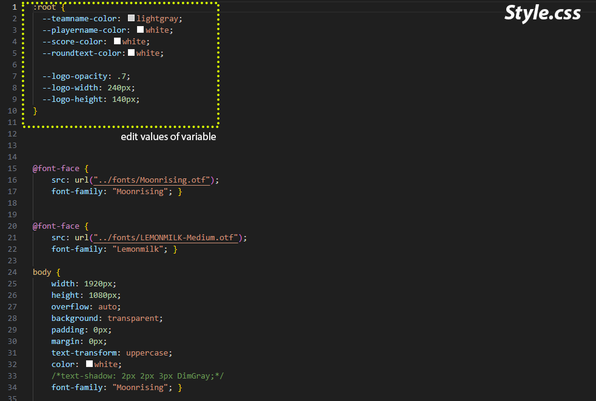
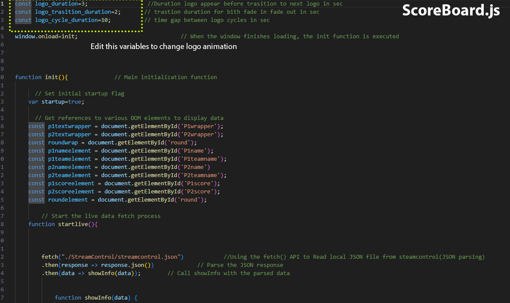
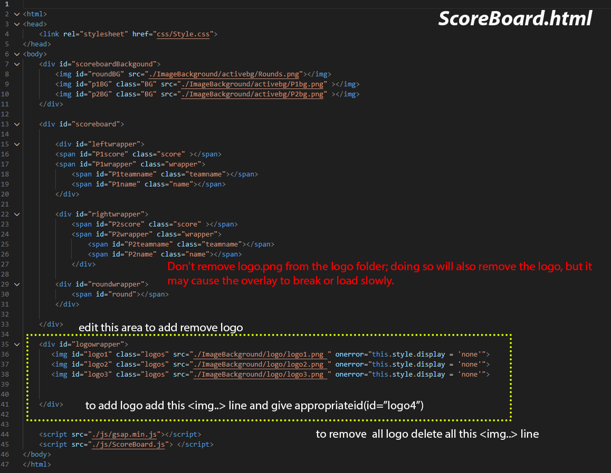

<h1 align="center">
  
FG Overlay
  
</h1>

<h4 align="center">A minimal Fighting game scoreboard overlay.</h4>


 
<p align="center">
  <a href="#About">About</a> •
  <a href="#how-to-use">How To Use</a> •
  <a href="#screenshots">Screenshots</a> •
  <a href="#notes">Notes</a> •
  <a href="#license">License</a>
</p>


## About

Fighting game scoreboard overlay (Tekken 8) designed for the tournament stream using HTML and JavaScript. Overlay is based on a browser source.
StreamControl generates a JSON file that is read by an HTML overlay, styled, animated, and presented using JavaScript. 

>Also works with UMVC3, DragonballFZ, SkullGirls, KOFXIV, TEKKEN 7, GuiltyGear-Strive, SF6, UNIST

## How To Use

To download file hit the code button and download zip

Add an HTML file to the browser source of your streaming program, and use StreamControl to provide overlay data and controls. 

There are three folders, each with a unique layout.

1.scoreboard only  (ScoreBoard.html)
2.scorboard + teambattle(3v3)  (ScoreBoard.html)
3.scoreboard and winner display   (ScoreBoard.html and windisplay.html)


The winner's name and character appear on an animated splashscreen. It contains a separate HTML file.
 

> **Note**
> ⭕ Each folder have its own streamcontrol with diffrent layout in streamcontrol folder

>⭕ when using scoreboard and winner display, You must add windisplay.html and scoreboard.html to two separate browser sources in order, with windisplay being the top layer.


## Screenshots


ScoreBoard           |  ScoreBoard + Teamnbattle       | ScoreBoard & Winner Display
:-------------------------:|:-------------------------:|:----------------------
  |  | 


## Notes

>Winner-Display is in experimental state may not be optimised, may lag or shutter.

*By modifying a CSS file, you can alter the font and colour of the text.

*By referencing a png file for the overlay, you can modify the design and create your own.

>🛑Important :To remove the logo at the bottom, erase the logo png files.Additionally, you can replace them with your own logo with same dimension

# Customize
This section will assist you in adding or removing a logo as well as making minor adjustments to text color, opacity, logo size, and logo animation duration. Some text editing (modifying code) required for this.

>🛑 All 3 layouts have their own separate files, so make sure you are editing stuff for the right layout/folder.

## 1. editing Text colors , logo size and logo opaicty . 
* This can be done by editing CSS file genrally located at ``Css/Style.css``.

* 1> open ``Style.css`` in any text editor ``FG-scoreboard-overlay-main\scoreboard only\Css\Style.css``
* 2> edit text as show in image.

* 3> Example 1- changing logo opacity edit value of ``--logo-opacity: 1`` (set it to 1 for max opacity)

* 4> Example 2- changing player name text color edit value of ``--playername-color: red`` [color values takes css predefined colorname like ``lightgrey``  or ``rgb(255,255,255)``->rgb(red,green,blue).]

* 5>Save the file



## 2. Changing , logo animation and transition duration . 
* This can be done by editing Javascript file genrally located at ``js/ScoreBoard.js``.

* 1> open ``ScoreBoard.js`` in any text editor ``FG-scoreboard-overlay-main\scoreboard only\js\ScoreBoard.js``

* 2> edit text as show in image.

* 3> Example 1- changing duration logo stay on screen before transition to next logo  edit value of ``logo_duration=5`` (logo appear for 5sec before transitioning into next logo)

* 4> Example 2- changing fade-in and fade-out duration edit value of ``logo_trasition_duration=2``(trasition takes 2 sec to fade in and 2 sec to fade out)

* 5>Save the file



## 2. Removing,Adding Logos .

> ### 🛑 Do not delete ``logo.png`` files from ``\ImageBackground\logo`` it will break overlay doing Following method is right way to delete or change logo

> ### ⭕ Tamplate code for logo -> ``````⭕ replace{x}with logo number

* this can be done by editing HTML file genrally located at ``ScoreBoard.html``.
> 
* 1> open ``ScoreBoard.html`` in any text editor ``FG-scoreboard-overlay-main\scoreboard only\ScoreBoard.html``

* 2> edit text as show in image.

* 3> Example 1- Adding more logo(adding logo 4). this can be by adding this line of code ``````inside logowrapper as shown in image.

* 4> Example 2- Removing All logo(no logo at bottom of screen). this can be by removing  line of code inside logowrapper(remove all ``````,``````,``````.....``````)

* 5>Save the file




## Thankyou

[farpenoodle's StreamControl](https://github.com/farpenoodle/StreamControl) - StreamControl


## Future Goals
* Lowerthird
* Brackets
* Flags
* New Design for layout
* Adjust for other games


## License

MIT

## github.com/Y3S99